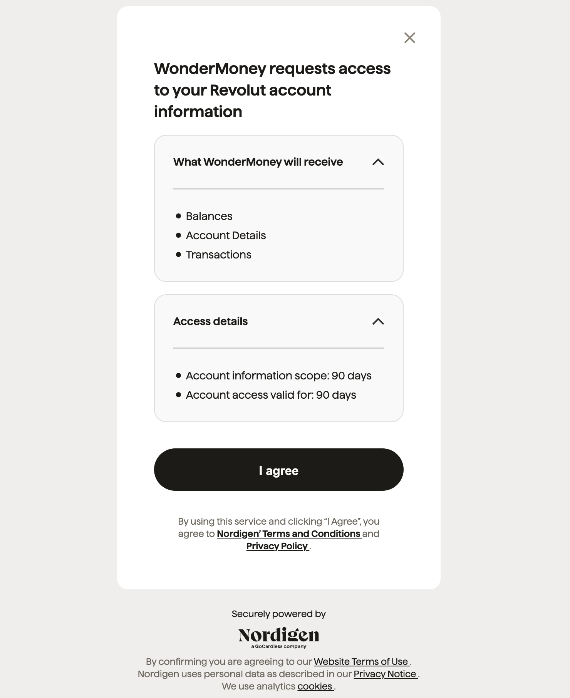

# Criar Conta

Uma conta é uma entidade que possui um saldo e transações. Isso é mais comumente usado para representar uma conta bancária.
Existem dois tipos de contas:

- **Vinculada**: Uma conta vinculada é conectada a uma conta bancária. Esta é a maneira recomendada de criar uma conta.
- **Não Vinculada**: Uma conta não vinculada é criada manualmente e não está associada a uma conta bancária.

## Contas Vinculadas

As contas vinculadas são conectadas a uma conta bancária. Esta é a maneira recomendada de criar uma conta.
Ao escolher criar uma conta vinculada, você será solicitado a selecionar o seu banco.
Neste momento, você será redirecionado para o portal do provedor para autenticar e vincular sua conta bancária. Atualmente, usamos a **Nordigen** (uma empresa da GoCardless) como nosso principal provedor, um agregador certificado de APIs PSD2.

Você poderá visualizar todas as informações que estamos solicitando da sua conta bancária: saldos, detalhes da conta e transações. Esta autorização é válida por **90 dias**, após os quais será necessário autenticar novamente.

:::info

Você será solicitado a autenticar diretamente com o seu banco. Nós **nunca** pediremos suas credenciais ou qualquer informação relacionada.

:::

Depois de vincular sua conta bancária, você será redirecionado de volta ao painel e sua conta será criada.

## Contas Não Vinculadas

As contas não vinculadas são criadas manualmente e não possuem uma conta bancária associada.
Neste caso, você precisará especificar o saldo inicial da conta.
Depois disso, você poderá adicionar transações manualmente à conta.

:::warning

Esta opção **não é recomendada**, pois não será possível importar transações automaticamente da sua conta bancária.

:::

## Perguntas Frequentes

### Meu banco não está listado

Estamos constantemente adicionando novos bancos à nossa lista. Se o seu banco não estiver listado, entre em contato conosco e o adicionaremos o mais rápido possível.

### Criei uma conta vinculada, mas não vejo nenhuma transação

Dependendo do seu banco, pode levar alguns minutos para que as transações sejam importadas. Se você não visualizar nenhuma transação após alguns minutos, entre em contato conosco.

### Posso alternar de uma conta não vinculada para uma conta vinculada, ou vice-versa?

No momento, isso só pode ser feito no nosso backoffice. Se precisar alterar o tipo de conta, entre em contato conosco e ajudaremos você.
