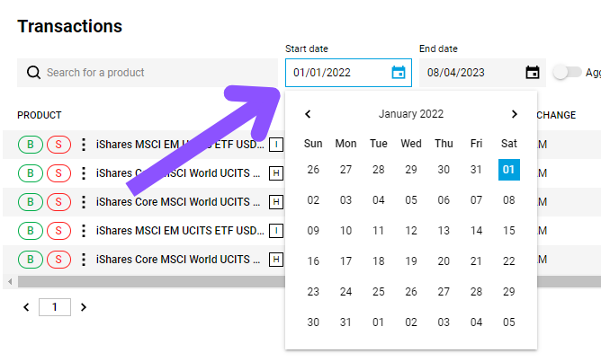
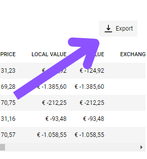
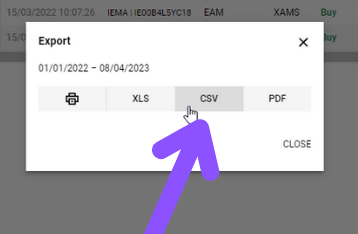

# Degiro

A Degiro é uma corretora europeia de desconto online que oferece acesso de baixo custo aos mercados financeiros em todo o mundo. Fundada em 2008, a Degiro disponibiliza uma ampla gama de produtos de investimento, incluindo ações, obrigações, opções, futuros e ETFs. Com presença em mais de 18 países, a Degiro tornou-se uma escolha popular para investidores que procuram taxas baixas e uma plataforma fácil de utilizar. A tecnologia inovadora e as operações simplificadas da Degiro permitem a execução eficiente de ordens, tornando-a uma opção atrativa tanto para investidores iniciantes como experientes.

## Exportar Transações

0. Inicie sessão na sua conta Degiro
1. Na barra lateral, passe o rato sobre **Caixa de Entrada** e clique em **Transações**

2. Selecione o **intervalo de datas** para as transações que deseja exportar.

3. Clique em **Exportar** no lado direito da página.

4. Selecione **CSV** como formato do ficheiro.

:::info

Se estiver a ter dificuldades em exportar as suas transações da Degiro ou a importá-las na nossa aplicação, por favor [contacte o suporte](mailto:support@wonder.money).

:::
